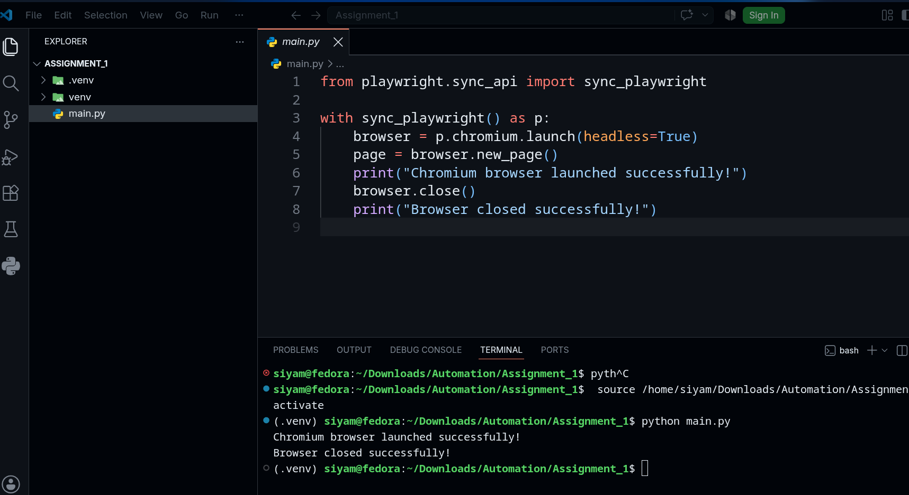

# Playwright Automation Assignment 1

This is my first browser automation assignment using Python and Playwright.

## Assignment Objective

The objective of this assignment is to set up Python with Playwright and create a simple automation script using the Chromium browser.

The script launches Chromium in headless mode, prints a success message in the terminal, and then closes the browser.

## Technologies Used

- Python 3
- Playwright
- Chromium
- VS Code
- GitHub

## Project Structure

```text
Assignment_1/
├── .gitignore
├── main.py
├── README.md
├── requirements.txt
└── terminal-output.png
```

## Setup Instructions

### 1. Create a Virtual Environment

```bash
python -m venv venv
```

### 2. Activate the Virtual Environment

For Linux/macOS:

```bash
source venv/bin/activate
```

For Windows Command Prompt:

```cmd
venv\Scripts\activate
```

### 3. Install Required Packages

```bash
pip install -r requirements.txt
```

Alternatively, Playwright can be installed directly using:

```bash
pip install playwright
```

### 4. Install Chromium

```bash
playwright install chromium
```

## Run

Run the Python script using:

```bash
python main.py
```

## Expected Output

```text
Chromium browser launched successfully!
Browser closed successfully!
```

## Output Screenshot

The screenshot below shows the successful execution of the automation script.



## Author

**Md Siyam Talukder**